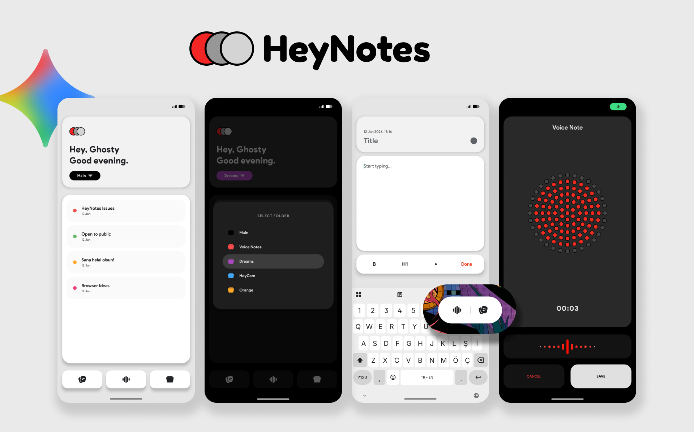

# HeyNotes - AI Powered Voice & Text Notes

HeyNotes is the smartest way to capture your thoughts. Powered by **Google Gemini AI**, it transforms your voice recordings into perfectly structured text, wrapped in a unique "Hole Punch" design with advanced organization features.

## 🌟 Key Features

### 🎙️ AI-Powered Transcription (Gemini 3 Flash)
HeyNotes goes beyond simple recording. It utilizes Google's latest **Gemini 3 Flash** model to understand and process your speech.
- **Smart Transcription:** Transcribes your audio in seconds with high accuracy.
- **Clean Verbatim:** Automatically removes filler words (like "umm", "ahh", "err"), stutters, and false starts. You get a clean, readable text, not just a raw dump.
- **Auto-Titling:** The AI analyzes the context of your recording and generates a concise, relevant title automatically.
- **Multi-Language Support:** Speak in any language; the AI detects it and transcribes it accurately in the original language.

### 📂 Smart Organization
Organizing your notes has never been this fluid.
- **Dynamic Folders (Pills):** Switch between categories instantly with a modern, color-coded "pill" interface.
- **Drag & Drop:** Move notes between folders easily using intuitive menus.
- **Favorites:** Keep your most important notes just a tap away.
- **View Options:** Choose between a detailed **List View** or a visual **Grid View**.

### 🎨 Unique & Modern Design
- **Hole Punch Aesthetic:** A visual style featuring a "hole punch" effect inspired by the beautiful radio made by Braun, giving your voice recorder a premium feel.
- **Fluid Animations:** Smooth Lottie animations enhance the voice recording and AI processing experience.
- **Theme Support:** Fully optimized for both Dark Mode and Light Mode to match your system settings.

### 📱 Quick Widget
- **Instant Access:** Start a voice recording or create a new text note directly from your home screen.
- **Pill-Shape Design:** A resizeable, modern widget that blends perfectly with your launcher.

### ☁️ Security & Backup
- **Google Drive Integration:** Coming soon.
- **PIN Protection:** Keep your private notes secure with an in-app PIN lock.

---
*Developed with ❤️ by Ghosty.*